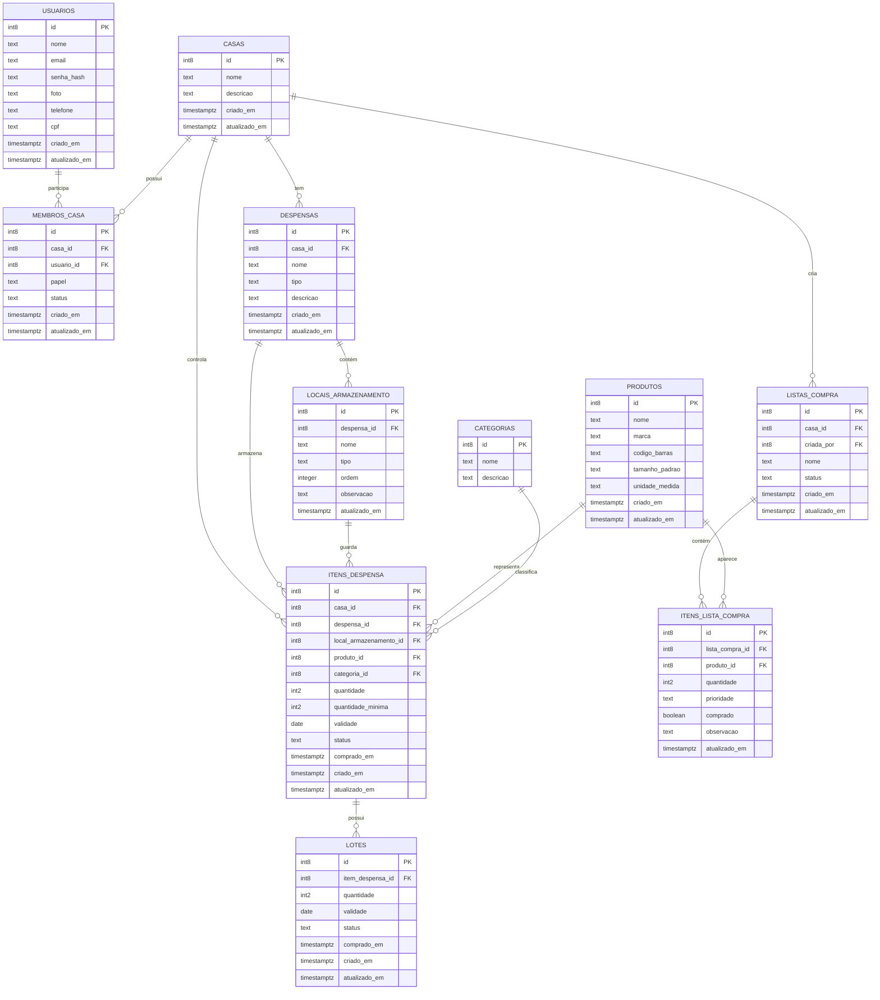

# Diagrama de Entidades e Tipos

## Explicação da modelagem

### 1. `usuarios`
Armazena os usuários da aplicação e o casal.

### 2. `casas`
Representa a residência compartilhada.

### 3. `membros_casa`
Relaciona usuários à casa e define o papel, por exemplo: administrador, membro.

### 4. `despensas`
Representa locais físicos de armazenamento, como geladeira, armário, despensa, etc.

### 5. `locais_armazenamento`
Representa prateleiras, gavetas, portas, etc.

### 6. `categorias`
Agrupa itens por tipo dentro do contexto da casa, como alimentação, limpeza, higiene, grãos, etc.

### 7. `produtos`
É o catálogo do produto base, sem depender da casa.

### 8. `itens_despensa`
É a instância real de um produto na casa. Aqui ficam:
- categoria específica da casa
- quantidade
- quantidade mínima
- validade
- localização física
- status do item

### 9. `lotes`
Permite controlar validade e compra por lote, quando o item chega em diferentes compras.

### 10. `listas_compra`
Armazena a lista de compras da casa.

### 11. `itens_lista_compra`
Relaciona a lista com o produto que precisa ser comprado.

## Observação importante

Para o seu cenário, a separação entre `produtos` e `itens_despensa` é a parte mais importante. Isso permite que o mesmo produto exista em vários locais da casa, com quantidade, validade e categoria específicos do contexto da casa.

A categoria foi movida para `itens_despensa` porque a classificação do estoque pode variar entre casas, mesmo para o mesmo produto, e isso deixa o modelo mais fiel ao uso real do sistema.
