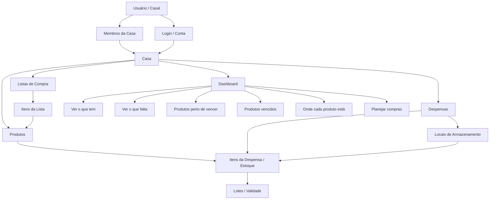

# Fluxo do Sistema

```mermaid
flowchart TD
    U[Usuário / Casal] --> MC[Membros da Casa]
    MC --> C[Casa]
    C --> D[Despensas]
    D --> LA[Locais de Armazenamento]
    C --> LP[Listas de Compra]
    C --> P[Produtos]
    P --> IT[Itens da Despensa / Estoque]
    D --> IT
    LA --> IT
    IT --> L[Lotes / Validade]
    LP --> ILC[Itens da Lista]
    ILC --> P

    U --> L1[Login / Conta]
    L1 --> C
    C --> A[Dashboard]
    A --> V[Ver o que tem]
    A --> F[Ver o que falta]
    A --> Venc[Produtos perto de vencer]
    A --> Venc2[Produtos vencidos]
    A --> Loc[Onde cada produto está]
    A --> Lista[Planejar compras]
```

## Descrição

Este fluxo mostra como o casal cria sua conta, monta a casa, organiza as despensas e acompanha estoque, locais, validade e compras.
