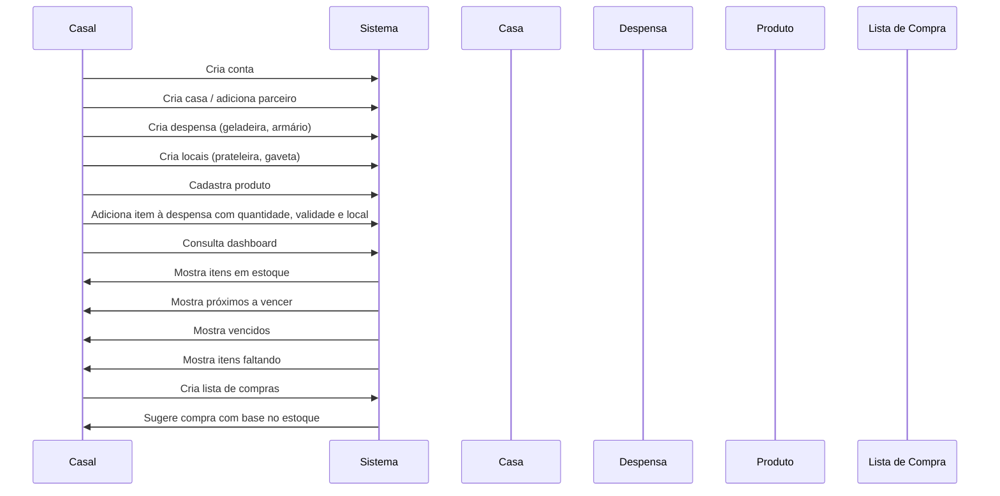

# Fluxo de Uso do Casal

```mermaid
sequenceDiagram
    participant U as Casal
    participant S as Sistema
    participant C as Casa
    participant D as Despensa
    participant P as Produto
    participant L as Lista de Compra

    U->>S: Cria conta
    U->>S: Cria casa / adiciona parceiro
    U->>S: Cria despensa (geladeira, armário)
    U->>S: Cria locais (prateleira, gaveta)
    U->>S: Cadastra produto
    U->>S: Adiciona item à despensa com quantidade, validade e local
    U->>S: Consulta dashboard
    S->>U: Mostra itens em estoque
    S->>U: Mostra próximos a vencer
    S->>U: Mostra vencidos
    S->>U: Mostra itens faltando
    U->>S: Cria lista de compras
    S->>U: Sugere compra com base no estoque
```

## Descrição

Este diagrama mostra o fluxo principal do uso diário do casal no sistema: cadastro, organização da casa, estoque e planejamento de compra.
