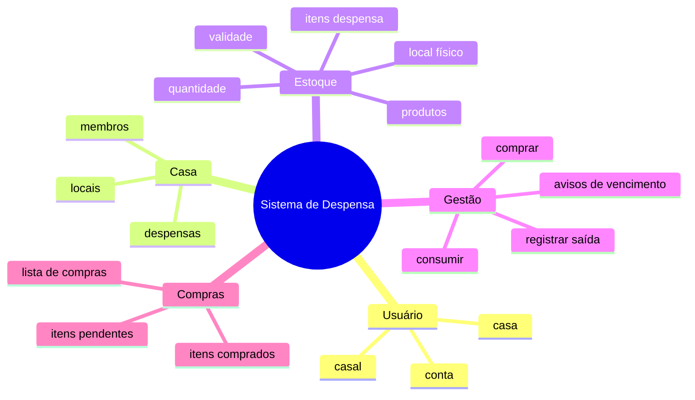

# Mapa do Domínio

```mermaid
mindmap
  root((Sistema de Despensa))
    Usuário
      conta
      casal
      casa
    Casa
      membros
      despensas
      locais
    Estoque
      produtos
      itens despensa
      quantidade
      validade
      local físico
    Gestão
      comprar
      consumir
      registrar saída
      avisos de vencimento
    Compras
      lista de compras
      itens pendentes
      itens comprados
```

## Descrição

O sistema funciona em três níveis: cadastro da casa, controle do estoque real e gestão de compras/alertas.
