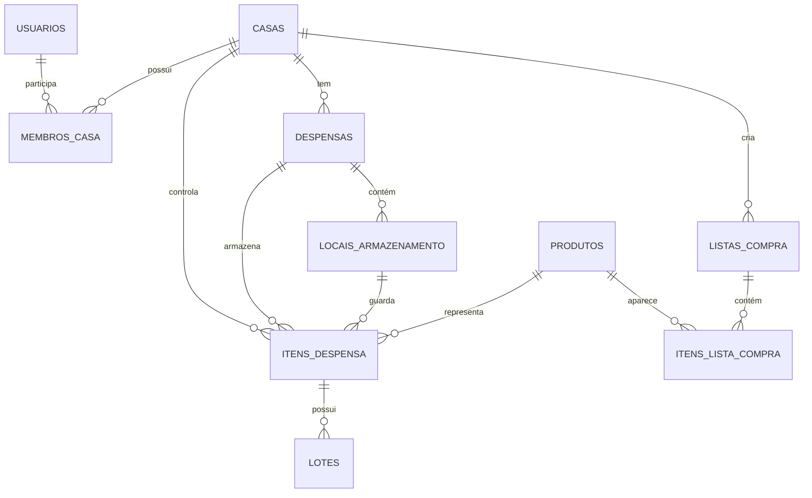

# Relacionamentos ER

```mermaid
erDiagram
    USUARIOS ||--o{ MEMBROS_CASA : participa
    CASAS ||--o{ MEMBROS_CASA : possui
    CASAS ||--o{ DESPENSAS : tem
    DESPENSAS ||--o{ LOCAIS_ARMAZENAMENTO : contém
    CASAS ||--o{ LISTAS_COMPRA : cria
    CASAS ||--o{ ITENS_DESPENSA : controla
    DESPENSAS ||--o{ ITENS_DESPENSA : armazena
    LOCAIS_ARMAZENAMENTO ||--o{ ITENS_DESPENSA : guarda
    PRODUTOS ||--o{ ITENS_DESPENSA : representa
    ITENS_DESPENSA ||--o{ LOTES : possui
    PRODUTOS ||--o{ ITENS_LISTA_COMPRA : aparece
    LISTAS_COMPRA ||--o{ ITENS_LISTA_COMPRA : contém
```

## Descrição

Representa a estrutura principal de relacionamento entre usuários, casa, despensas, locais, produtos, estoque e listas de compra.
